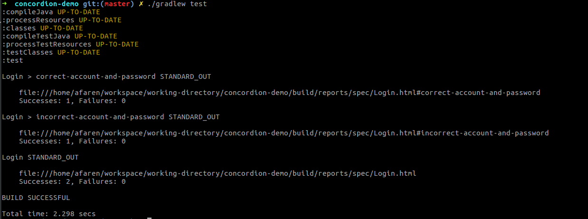
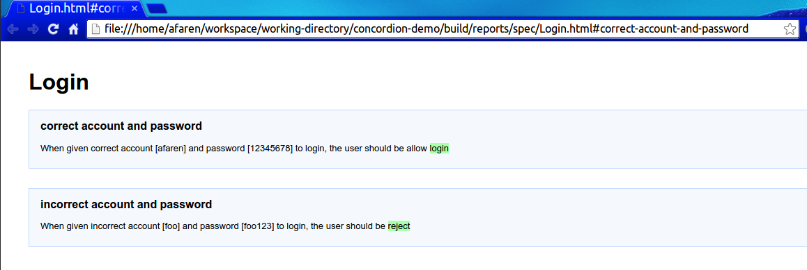
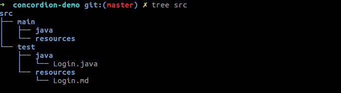

# Concordion Demo

参考 [Concordion Office site](http://concordion.org/) 做的一个 Demo

## 环境配置 
本 Demo 需要使用 JDK 

## 运行 Demo

终端下运行 `./gradlew test`，可以看到类似下图的结果  
  
拷贝链接 `file:///home/afaren/workspace/working-directory/concordion-demo/build/reports/spec/Login.html` 到浏览器，可以看到执行报告

## 结构
查看项目结构，可以看到

其中代码全部放在 `test` 目录下，其中，Java 类 `Login` 是 fixture，而 resource `Login.md` 是可执行的测试文档，即 specification。
书写 Concordion 测试时，将测试全部放在 specification 中，而 fixture 只是用来帮助构建测试用例的固件。

> 测试文档可以用 `Markdown` 或者 `HTML` 语法写，这里选择 `Markdown`。

